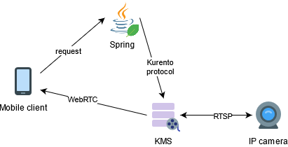
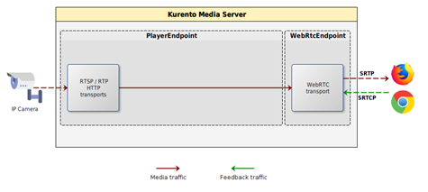
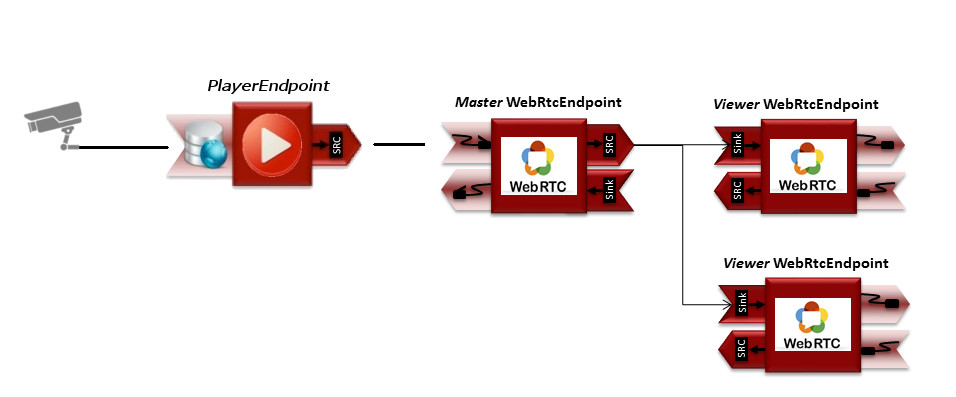

# MIEMcam медиа сервер
Программа предназначается для проброса видеопотока от IP
камер из внутренней сети университета МИЭМ НИУ ВШЭ к 
мобильному или браузерному клиенту в интернете с минимальной 
задержкой.

Медиа сервер разрабатывается для мобильного приложения
[MIEMapp](https://play.google.com/store/apps/details?id=ru.hse.miem.miemapp)

##  Решение
Решение разделено на две части: медиа сервер и управляющий сервер. 
В качестве первого взят Kurento, управляющий сервер написан на языке 
Java фреймворке Spring и представлен в этом репозитории. 

Основной функцией управляющего сервера является 
получение специальных
команд от мобильного или браузерного клиента по WebSocket технологии 
для формирования команды уже для медиа сервера. Сформированная команда
для медиа сервера описывает шлюз, который принимает видеопоток с 
указанной клиентом IP камеры и отдаёт его с медиа сервера по 
протоколу WebRTC. 

Управляющий сервер передаёт эту команду по Kurento протоколу медиа серверу, 
который, в свою очередь, её реализует и 
транслирует клиенту поток с камеры в WebRTC формате.


Далее рассмотрим более подробно сущности решения 
### Медиа сервер
Kurento Media Server распространяется в виде монолитной программы-сервера 
и не требует никаких дополнительных разработок внутри себя. Все 
взаимодействие с ним происходит по клиент-серверной модели.

Самая простая установка Kurento медиа сервера реализована через Docker.
Это делается всего за две команды, весь процесс установки 
описан в [официальной документации](https://doc-kurento.readthedocs.io/en/latest/user/installation.html#docker-image).

Для программирования Kurento медиа сервера требуется посылать команды по
специальному Kurento протоколу. Для облегчения этого процесса Kurento 
создали библиотеку для языка Java фреймворка Spring, на чём и написан 
управляющий сервер, речь о котором пойдёт далее.

### Управляющий сервер
Представлен в этом репозитории. Сделан на основе 
[туториала Kurento по трансляции видео файлов](https://doc-kurento.readthedocs.io/en/latest/tutorials/java/tutorial-player.html)
.
 
#### Принимаемые команды
На вход сервер принимает текстовые команды по WebSocket. Эта логика описана в PlayHandler.java
```java
  @Override
  public void handleTextMessage(WebSocketSession session, TextMessage message) throws Exception {
    JsonObject jsonMessage = gson.fromJson(message.getPayload(), JsonObject.class);
    String sessionId = session.getId();
    try {
      switch (jsonMessage.get("id").getAsString()) {
        case "start":
          start(session, jsonMessage);
          break;
        case "stop":
          stop(sessionId);
          break;
        case "onIceCandidate":
          onIceCandidate(sessionId, jsonMessage);
          break;
        default:
          sendError(session, "Invalid message with id " + jsonMessage.get("id").getAsString());
          break;
      }
    } catch (Throwable t) {
      log.error("Exception handling message {} in sessionId {}", jsonMessage, sessionId, t);
      sendError(session, t.getMessage());
    }
  }
```

Основные методы, на которые нужно обратить внимание, это `start` и `stop`.
В коде есть и другие методы, типа `pause` и `resume`, но для приложения MIEMapp 
их использование не требуется, поэтому здесь их описание опущено.

Метод `start` собирает ICE кандитаты,
 формирует специальный пайплайн, состоящий из двух медиа
элементов: `playerEndpoint` и `WebRtcEndpoint`, и отсылает назад клиенту 
SDP описание видеопотока через `startResponse` сообщение.


```java
// 1. Media pipeline
private void start(final WebSocketSession session, JsonObject jsonMessage) {
    // 1. Media pipeline
    final UserSession user = new UserSession();
    MediaPipeline pipeline = kurento.createMediaPipeline();
    user.setMediaPipeline(pipeline);
    WebRtcEndpoint webRtcEndpoint = new WebRtcEndpoint.Builder(pipeline).build();
    user.setWebRtcEndpoint(webRtcEndpoint);
    String videourl = jsonMessage.get("videourl").getAsString();
    final PlayerEndpoint playerEndpoint = new PlayerEndpoint.Builder(pipeline, videourl).build();
    user.setPlayerEndpoint(playerEndpoint);
    users.put(session.getId(), user);

    playerEndpoint.connect(webRtcEndpoint);

    // 2. WebRtcEndpoint
    // ICE candidates
    webRtcEndpoint.addIceCandidateFoundListener(new EventListener<IceCandidateFoundEvent>() {

      @Override
      public void onEvent(IceCandidateFoundEvent event) {
        JsonObject response = new JsonObject();
        response.addProperty("id", "iceCandidate");
        response.add("candidate", JsonUtils.toJsonObject(event.getCandidate()));
        try {
          synchronized (session) {
            session.sendMessage(new TextMessage(response.toString()));
          }
        } catch (IOException e) {
          log.debug(e.getMessage());
        }
      }
    });

    // Continue the SDP Negotiation: Generate an SDP Answer
    String sdpOffer = jsonMessage.get("sdpOffer").getAsString();
    String sdpAnswer = webRtcEndpoint.processOffer(sdpOffer);

    log.info("[Handler::start] SDP Offer from browser to KMS:\n{}", sdpOffer);
    log.info("[Handler::start] SDP Answer from KMS to browser:\n{}", sdpAnswer);

    JsonObject response = new JsonObject();
    response.addProperty("id", "startResponse");
    response.addProperty("sdpAnswer", sdpAnswer);
    sendMessage(session, response.toString());

    webRtcEndpoint.addMediaStateChangedListener(new EventListener<MediaStateChangedEvent>() {
      @Override
      public void onEvent(MediaStateChangedEvent event) {

        if (event.getNewState() == MediaState.CONNECTED) {
          VideoInfo videoInfo = playerEndpoint.getVideoInfo();

          JsonObject response = new JsonObject();
          response.addProperty("id", "videoInfo");
          response.addProperty("isSeekable", videoInfo.getIsSeekable());
          response.addProperty("initSeekable", videoInfo.getSeekableInit());
          response.addProperty("endSeekable", videoInfo.getSeekableEnd());
          response.addProperty("videoDuration", videoInfo.getDuration());
          sendMessage(session, response.toString());
        }
      }
    });

    webRtcEndpoint.gatherCandidates();

    // 3. PlayEndpoint
    playerEndpoint.addErrorListener(new EventListener<ErrorEvent>() {
      @Override
      public void onEvent(ErrorEvent event) {
        log.info("ErrorEvent: {}", event.getDescription());
        sendPlayEnd(session);
      }
    });

    playerEndpoint.addEndOfStreamListener(new EventListener<EndOfStreamEvent>() {
      @Override
      public void onEvent(EndOfStreamEvent event) {
        log.info("EndOfStreamEvent: {}", event.getTimestamp());
        sendPlayEnd(session);
      }
    });

    playerEndpoint.play();
  }
```
Из кода под комментарием `// 1. Media Pipeline`
 видно, что `WebRtcEndpoint` подключен последовательно в
`playerEndpoint`. Ссылку на источник видео
`playerEndpoint` берёт из клиентского json запроса.

Такой пайплайн реализует самую простую структуру. Видепоток
забирается с камеры и отдаётся по WebRTC без перекодировки и 
прочих изменений.



В [другом своём Kurento туториале one-to-many broadcast](https://doc-kurento.readthedocs.io/en/latest/tutorials/java/tutorial-one2many.html)
предложена схема, с помощью которой можно дополнить текущую:
каждый клиент не создаёт целый новый пайплайн, а соединяет новоподключённый клиентский 
`WebRtcEndpoint` уже к существующему `PlayerEndpoint`, таким образом, 
на каждую камеру нужен только один `PlayerEndpoint` и по `WebRtcEndpoint` на 
каждого клиента.



Однако такая схема не может быть
применена в силу того, что некоторые камеры МИЭМ могут проводить RTSP общение с клиентом, 
но не отдавать видео после этого общения. 
Это происходит тогда, когда одновременно подключаются 
два клиента - одного камера обслуживает, а другой клиент натыкается на проблему, когда
RTSP общения прошло, но вместо видео отдаётся ничего. Более того, все известные плееры,
типа vlc или ffmpeg, не выкидывают ошибку при такой ситуации, 
а просто молча показывают ничего.
Если при улучшенной схеме произойдёт такая проблема, то все клиенты будут бесконечно
видеть черный экран до полной перезагрузки сервера.
Сейчас же клиент может через некоторое время повторить создание пайплайна и есть
вероятность, что эта ошибка не повторится. 
Поэтому внедрение улучшенной 
конструкции ещё подлежит изучению.

Метод `stop` удаляет объект сессии конкретного пользователя и
уничтожает pipeline.
```
private void stop(String sessionId) {
    UserSession user = users.remove(sessionId);
    if (user != null) {
      user.release();
    }
  }
```
#### Разрешение всех источников
Клиентское приложение может иметь источник (origin), отличный от адреса самого 
управляющего сервера, например none, если встроить клиентскую страницу в 
мобильное приложение (то есть страница считывается прямо с диска, а не раздаётся 
с сервера). Для того, чтобы в этом случае сервер мог общаться с веб клиентом,  
встроенным в мобильное приложение, нужно на сервере разрешить источники, 
помимо адреса самого сервера.
 
 В коде это сделано в файле PlayerApp.java c помощью setAllowedOrigins("*")
 ```java
@Override
public void registerWebSocketHandlers(WebSocketHandlerRegistry registry) {
    registry.addHandler(handler(), "/player").setAllowedOrigins("*");
}
```

#### Защита и HTTPS
[Инструкция по обретению SSL ключей](https://certbot.eff.org/lets-encrypt/ubuntubionic-other)

[Инструкция по настройке HTTPS на управляющем сервере из официальной документации](https://doc-kurento.readthedocs.io/en/latest/features/security.html#configure-a-java-server-to-use-https)
 
### Клиентское приложение
 [Минимальное клиентское приложение](https://github.com/MikhaelMIEM/media_server_2_minimal_client)
 для встраивание в мобильное приложение и другие проекты.
 В этом примере требуется только вставить ссылку на источник видео во
 внутренней сети МИЭМ и начнётся показ видео.